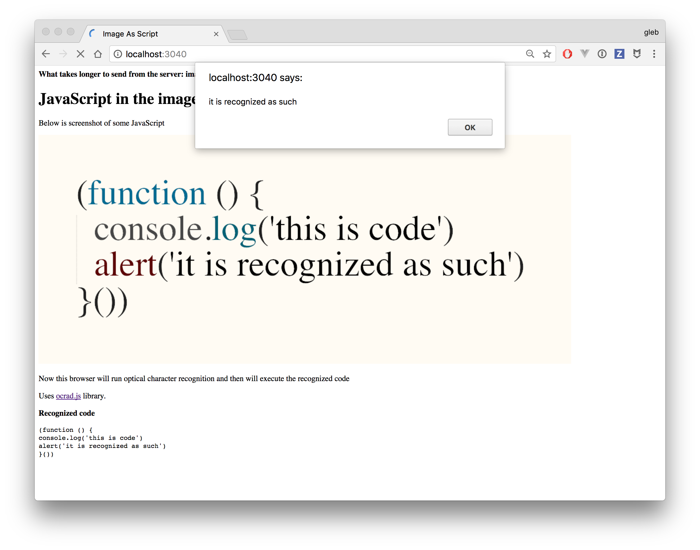

# image-as-script

People argue why the websites are so slow - is it the large images or lots of 
JavaScript? The next natural step is to send large images *with JavaScript*.
Then one can run [character recognition library](https://github.com/antimatter15/ocrad.js) 
to get the JavaScript out of the image and execute it. Seems reasonable.

This repo: [https://github.com/bahmutov/image-as-script](https://github.com/bahmutov/image-as-script)
